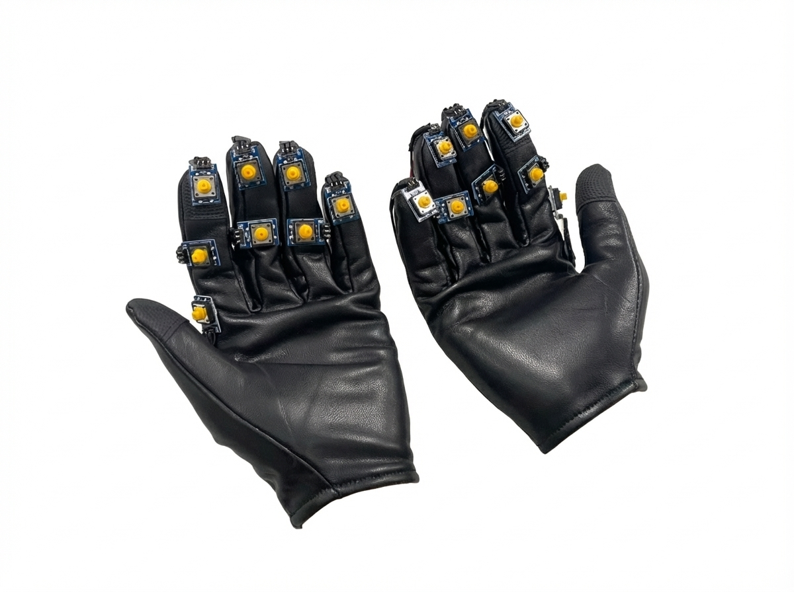
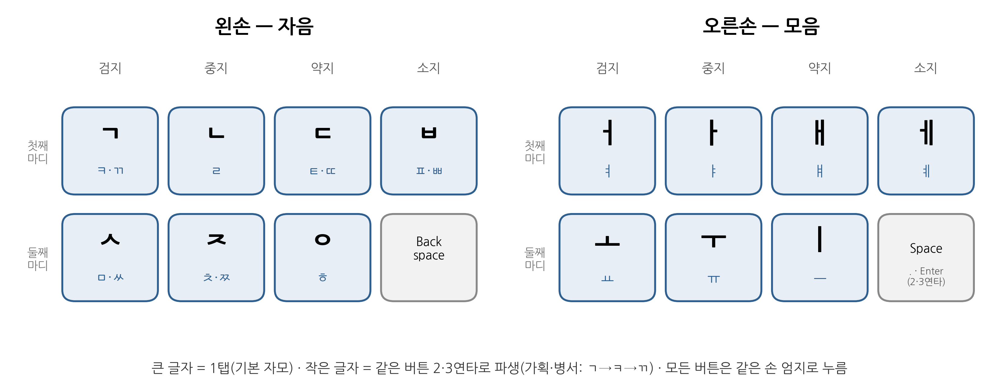
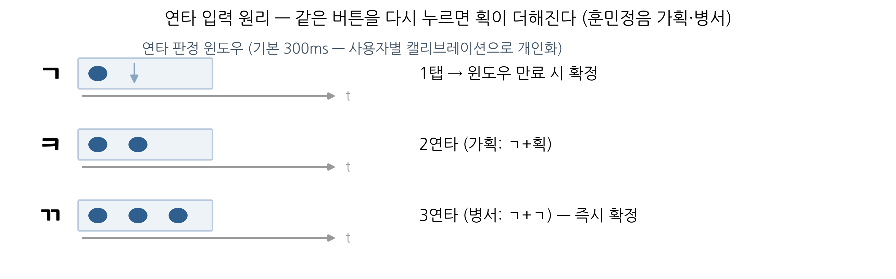
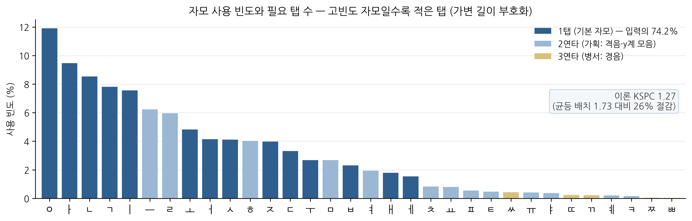
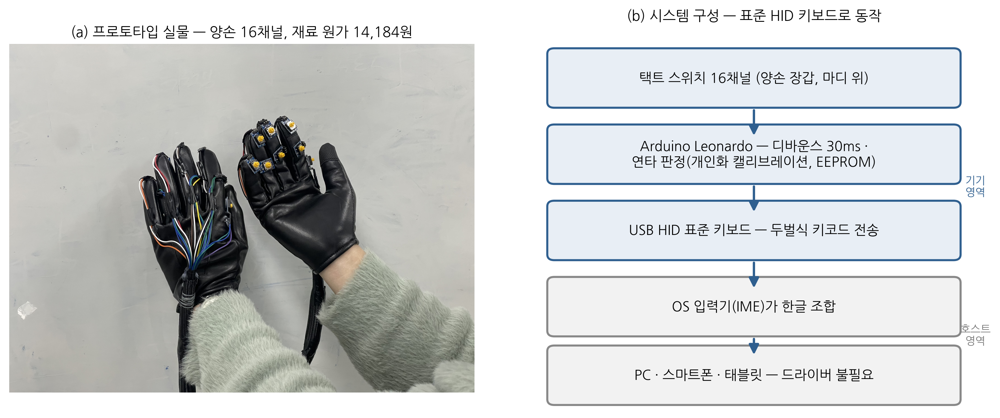

# Keyboard In My Hand

**A glove-type wearable Hangul keyboard — type Korean anywhere, in any posture, without looking.**

<p align="center">
  
</p>

<!-- TODO: demo GIF — eyes-free typing, one take -->

16 tactile switches on the finger phalanxes of a pair of gloves, pressed by the same hand's thumb.
The device enumerates as a **standard USB HID keyboard** sending Dubeolsik (두벌식) keycodes —
no driver, no companion app; the OS IME composes Hangul exactly as with a desktop keyboard.

Built for the Mechatronics course at Seoul National University and exhibited at the
15th SNU College of Engineering **Creative Design Festival** (창의설계축전, 2026).

## Why

Keyboards have kept the "board on a desk" form factor for over a century, which breaks down when:

- **VR/AR** — with an HMD on, expert typists drop from 41.4 to 26.3 WPM on a physical keyboard,
  and controller-pointing virtual keyboards top out around 15 WPM. Text entry is a known
  bottleneck of XR (CHI 2025 survey).
- **Accessibility** — Korean braille notetakers cost ~₩6,000,000, yet only 13.7% of Korean
  visually-impaired people can read braille. There is no low-cost, braille-free tactile
  text-entry device for the remaining ~86%.
- **Posture** — desk-bound typing anchors the neck-forward, seated posture associated with
  musculoskeletal load (7.05M VDT-syndrome patients in Korea, 2024).

**Total BOM: ₩14,184** — deliberately built from commodity parts. The contribution is the
input *mechanism*, not the form factor; switches, gloves and wireless are swappable layers.

## How it works

<p align="center">
  
</p>

1. **Phalanxes are built-in keycaps.** HCI research (DigitSpace, CHI '16) shows people can
   distinguish ≥16 buttons on their fingers eyes-free via proprioception. 8 buttons per hand
   stays comfortably within that capacity. Button positions were selected from user tests of
   thumb-reach comfort ("sweet spots").
2. **Multi-tap = stroke addition (가획).** Base consonants/vowels are one tap; derived jamo
   come from tapping the *same* button again (ㄱ→ㅋ→ㄲ), mirroring how Hangul letters are
   graphically derived. One rule to memorize. Because Hangul base letters largely coincide
   with the highest-frequency jamo, this learnability-first layout inherits frequency-optimal
   coding: **KSPC 1.27** (−26% vs. frequency-blind layout), **74% of input is a single tap**
   (see [`analysis/RESULTS.md`](analysis/RESULTS.md)).

   <p align="center">
     
     <br/>
     
   </p>
3. **Sequential, never chorded.** Chorded keyboards have failed for 40 years on memorization
   burden (Twiddler: 4.3 WPM in session 1). Discrete tactile switches give a deterministic,
   eyes-free confirmation click — no probabilistic gesture recognition.
4. **Per-user calibration.** The multi-tap window (default 300 ms) is calibrated per user by
   [`experiments/speed_test.py`](experiments/speed_test.py): the firmware is flipped to a
   raw-tap mode, the user types two sentences, and every inter-tap interval is labelled
   *intentional multi-tap* vs *separate keystroke that happens to reuse the button* by
   aligning the observed keydowns against the target sequence from `mapping.json`. The tool
   then picks the threshold minimising misclassification and **rewrites
   `TAP_WINDOW_DEFAULT` in the .ino directly** (bumping a `CAL_STAMP` so the board's stored
   EEPROM value cannot shadow the newly calibrated one). No serial port, no extra packages.

Pilot speed: **9–15 WPM** (3 users) — on par with state-of-the-art hands-/eyes-free
techniques (9–16 WPM range at CHI '18–'26).

## Repository structure

```
firmware/
  keyboard_glove/         Arduino Leonardo firmware (USB HID, multi-tap engine,
                          raw-tap measurement mode, calibration block patched by the
                          calibration tool, CAL_STAMP + EEPROM persistence)
  keyboard_glove/legacy/  original course-project sketch (development history)
  calibrate_window.py     optional serial route: tune the window live without re-flashing
experiments/
  PROTOCOL.md             5-experiment protocol (Korean): button reach-time & mapping
                          cost, learning curve, usability/posture, cursor-OSK comparison,
                          eyes-free — standard text-entry methodology (MacKenzie et al.)
  logger.py               transcription/tapping logger GUI (stdlib only)
  speed_test.py           1-minute random-word speed test GUI
  tv_osk_test.py          TV-remote-style cursor on-screen keyboard (comparison baseline,
                          incl. a full Dubeolsik composition automaton)
  analyze.py              metrics & figures: CPM/WPM, MSD error rate, learning curve,
                          mapping-cost vs. 10,000 random layouts
  mapping.json            16-button ↔ jamo mapping (single source of truth)
analysis/
  mapping_analysis.py     corpus → jamo frequency, KSPC, same-button bigram rate
  RESULTS.md              current quantitative results
docs/images/              photos & diagrams
```

## Hardware

<p align="center">
  
</p>

| Part | Qty | Note |
|---|---|---|
| Tactile switch | 16 | 2 per finger (index–ring), 1 on pinky + 1 function key, per hand |
| Arduino Leonardo (ATmega32u4) | 1 | native USB HID |
| Gloves, wiring harness | 1 set | |
| **Total BOM** | | **₩14,184** |

Flash `firmware/keyboard_glove/keyboard_glove.ino` (Arduino IDE, board: Leonardo).
Serial commands at 115200 baud: `W<ms>` set tap window · `S` save to EEPROM ·
`C1/C0` calibration stream · `?` status.

## Running the experiment tools

```bash
# needs Python 3.8+; GUIs use tkinter (stdlib), no pip packages
python experiments/speed_test.py            # 1-min speed test + tap-window calibration
python experiments/speed_test.py --selftest # verify metrics & .ino patching without a GUI
python experiments/logger.py --mode transcribe --participant P01 --session S1
python experiments/logger.py --mode tap --self-test
python experiments/tv_osk_test.py           # cursor-OSK baseline (--selftest available)
python experiments/analyze.py transcribe    # figures (needs matplotlib)
python firmware/calibrate_window.py         # optional serial route (pip install pyserial)
```

## Results

- Mapping efficiency & pilot speed: [`analysis/RESULTS.md`](analysis/RESULTS.md)
- Learning curve, cursor-OSK comparison, eyes-free study: **in progress** (protocol in
  [`experiments/PROTOCOL.md`](experiments/PROTOCOL.md)) <!-- TODO: add figures -->
- Competition report: to be published after the festival (Sept 2026) <!-- TODO -->

## Team

Department of Mechanical Engineering, Seoul National University.
<!-- TODO: names & roles, e.g.
- OOO — mechanical design & glove integration
- OOO — circuit & firmware (multi-tap engine)
- OOO — user studies & data analysis
-->

## License

[MIT](LICENSE) — hardware design, firmware and experiment tools.
