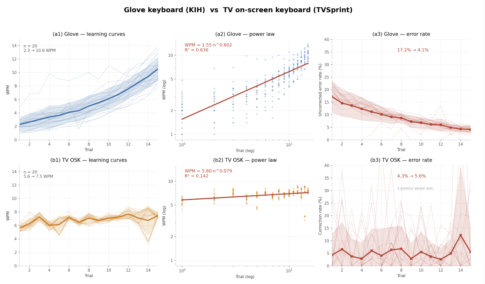

# Results

Every figure on this page is computed from [`experiments/logs/speed_vs_tv_all.csv`](../experiments/logs/speed_vs_tv_all.csv)
(600 trials, [data dictionary](../experiments/logs/README.md)). Run
`python analysis/verify_results.py` to recompute them and fail on any mismatch.

## 1. User study — KIH vs. TV on-screen keyboard

**Design.** Within-subject, 20 participants. Two conditions: KIH (glove) and a TV-style cursor
on-screen keyboard (arrow-key navigation + select, the method used on smart TVs and in XR).
Condition order counterbalanced across participants. Each condition: 10 minutes of training, then
**15 one-minute trials**. Words were drawn at random from a fixed 300-word pool, and participants
typed **without looking at the device**.

**Metrics.** Speed as WPM = jamo-per-minute ÷ 5 (so figures are comparable with the international
literature). Accuracy: MSD-based uncorrected error rate for KIH, and excess-keystroke (correction)
rate for the cursor keyboard — the two definitions are not interchangeable, so accuracy is compared
as a *trend*, not head-to-head. A corrected KSPC (excluding backspace and submit keys) was used to
check that the designed keystroke cost reproduces in real use.

  

| | KIH (glove) | TV on-screen keyboard |
|---|---|---|
| Speed, trial 1 | 2.3 WPM | 5.6 WPM |
| Speed, trial 15 | **10.6 WPM** (4.6×) | 7.5 WPM |
| Power-law fit | WPM = 1.55·n0.602, R² = 0.636 | WPM = 5.80·n0.079, R² = 0.142 |
| Accuracy, trial 1 → 15 | 17.2% → **4.1%** uncorrected error (−76%) | 4.3% → 5.6% correction rate |
| Crossover | passes the baseline at ≈ trial 9 | — |

**Reading the fits.** The exponent is the whole story: 0.602 against 0.079. The baseline was
already saturated at first contact — participants arrive knowing how to drive a cursor keyboard,
and that is as fast as the method gets (its R² of 0.142 says the "learning curve" is mostly
noise). KIH starts less than half as fast and is still climbing at trial 15. Extrapolating the
fit gives ≈12 WPM at 30 trials and ≈16 WPM at 50.

**No speed–accuracy trade-off.** Both improved together: 4.6× faster while uncorrected errors fell
76%. The usual concern about a new input method — that early speed is bought with errors — does not
appear here.

**Context.** 10.6 WPM after 15 minutes of practice sits with recent hands-/eyes-free techniques
(ankle gestures 11–13 WPM, CHI 2026; head gestures 9.8 WPM) and above the ~8 WPM reported for
commercial cursor-selection keyboards — while leaving gaze and posture unconstrained, which none
of those baselines do simultaneously.

## 2. Mapping efficiency — corpus analysis

Corpus: 199,806 keystroke-level jamo from modern Korean prose, cross-checked against the National
Institute of Korean Language frequency survey (`mapping_analysis.py`).

| Metric | Value | Note |
|---|---|---|
| Theoretical KSPC (taps per jamo) | **1.269** | multi-tap layout |
| KSPC of a frequency-blind uniform layout | 1.727 | baseline |
| Reduction | **−26.5%** | from the base-jamo = 1 tap structure |
| Input completed in a single tap | **74.2%** | |
| Adjacent jamo pairs sharing a button | **3.60%** | only these pay the multi-tap timeout |
| Most frequent same-button pair | ㅡ+ㅣ (syllable 의) | ≈32% of all same-button pairs |

The layout was designed for **learnability first** — follow Hangul's own 가획·병서 derivation and
the only rule to memorize is "same family, same button, press again." The efficiency above is a
by-product: Hangul's base letters largely coincide with its highest-frequency jamo, so a
derivation-faithful layout is also close to a frequency-optimal one.

## 3. Firmware timing

The multi-tap engine is verified on the host without hardware
(`make -C firmware/keyboard_glove/test both`, 16 checks × 2 build configurations):

- a tap sequence commits immediately once no further tap can extend it (3 taps for most
  consonants, 2 for vowels, 1 for function keys) — no timeout wait
- a sequence interrupted by a different button commits early rather than merging
  (ㄱ+ㅏ+ㄱ typed quickly stays ㄱㅏㄱ instead of collapsing to ㅋㅏ)
- switch chatter inside the debounce window is not counted as a tap
- ㅢ (ㅡ = 2 taps, then ㅣ = 1 tap on the same button) resolves correctly

The tap window itself is not a fixed constant: it is measured per user by
`tap_calibration.py`, which labels every inter-tap interval as intentional multi-tap or separate
keystroke and picks the threshold that minimises misclassification.
